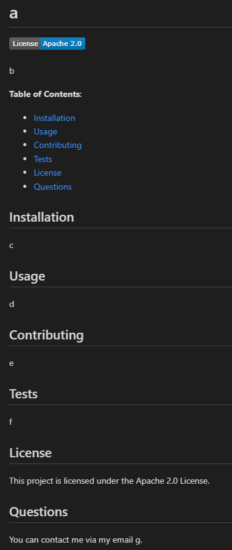

# README Generator


This is my solution for the Module 11 Challenge of the edX front-end bootcamp. It's a README Generator that takes input from the user using inquirer and then outputs to a markdown file.

**Table of Contents**:
- [Installation](#install)
- [Usage](#usage)
- [Credits](#credits)

<a id="install"></a>
## Installation
First, you'll want to clone the repository.
```bash
git clone https://github.com/iy2k22/readme-generator.git
cd readme-generator
```
Then, you'll want to install the dependenices.
```bash
npm i
```

<a id="usage"></a>
## Usage
Once you've installed the dependencies, you can use the generator like so:
```bash
node index.js
```
Once you've completed the questions, `out.md` should be generated.

<a id="credits"></a>
## Credits
* [Inquirer.js](https://github.com/SBoudrias/Inquirer.js)